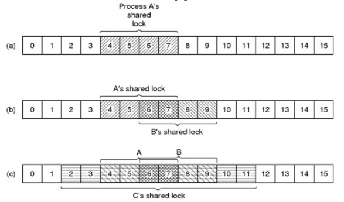

<!-- $theme: gaia -->
<!-- $size: 16:9 -->


# Clase 5

---

<!-- page_number: true -->

### En la clase anterior
#### Problemas con Pipes/Fifos:

* Lectura no atómica -> No pueden leer muchos
	* Si quiero hacer esto, necesito evitar que todos lean a la vez 

#### Problemas con Archivos:

* No proveen un mecanismo de sincronización

---
<!-- *page_number: false -->

# Clase 5
## Locks

---

### Locks

Mecanismo de sincronismo de acceso a un archivo

* Están pensados para archivos estructurados

* En general se utilizan para sincronizar el acceso a cualquier otro recurso


==:warning: En unix, los locks son **advisor** (pueden ser ignorados) :warning:==

---

### Tipos

* Exclusivos (_Exclusive Locks_)
	* También conocido como _Lock de Escritura_
	* Solo un proceso a la vez puede tomar el lock


* Compartidos (_Shared Locks_)
	* También conocido como _Lock de Lectura_
	* Más de un proceso puede tomar el mismo lock
	* Se usan en conjunto con los exclusivos

---
### Condiciones

* Exclusivos
	* Para poder tomar el lock, el proceso debe esperar a que no haya locks de ningun tipo tomados
* Compartidos
	* Para poder tomar el lock, el proceso debe esperar a que no haya locks exclusivos tomados


---
### Condiciones (cheatsheet) 

<center>
<table>

<tr><td rowspan="2" colspan="2"><th colspan="2">Lock pedido
<tr><th>Compartido (Lectura)<th>Exclusivo (Escritura)
<tr><th rowspan="3">El archivo tiene<td>Ningún lock<td>OK<td>OK
<tr><td>Uno o más locks de lectura<td>OK<td>Denegado
<tr><td>Un lock de escritura<td>Denegado<td>Denegado

</table>
</center>

---
<!-- *page_number: false -->

## Operaciones

---
### Operaciones

<center>
  
|Operación|Locks|
|:--:|:--:|
|Obtener| ? | 
|Liberar| ? |


:bulb: Funcionan sobre archivos :bulb:
==:bulb: no hay operaciones de creación/destrucción **propias de locks** :bulb:==

</center>
  
---
### Flujo general

1) Abrir el archivo a lockear
2) Aplicar el lock:
 * Opciones
 	* `fcntl`
 		* Completando los campos de la estructura `struct flock`
 	* `flock`
 
 	* `lockf` (Es una interfaz construida sobre `fcntl`)
  

---
# Apertura del archivo 
## `open`

---
### Apertura del archivo `open`

```c
int open (const char* pathname, int flags);
```

El modo de apertura depende del tipo de lock
 * Lock Exclusivo	 
	* `O_WRONLY` / `O_RDWR`
 * Lock Compartido
	* `O_RDONLY` / `O_RDWR`

---
# Establecimiento del lock
## `fcntl`
### (Método 1)

---
### Estructura `flock`

* `l_type` : Tipo de lock
  * `F_WRLCK` : Exclusivo
  * `F_RDLCK` : Compartido
  * `F_UNLCK` : Liberar el lock 
  	
* `l_whence` : Dentro del archivo, byte desde el cual se quiere lockear
  * `SEEK_SET` : Inicio del archivo
  * `SEEK_CUR` : Posición actual del cursor
  * `SEEK_END` : Desde el final

---
### Estructura `flock`

* `l_start` : Byte de inicio del lock relativo a `l_whence`
  * Con `SEEK_CUR` y `SEEK_END`, puede ser un valor negativo
  	
* `l_len` : Tamaño de la región a lockear
	* Con 0 se bloquea hasta el `EOF`

---

### Estructura `flock`


Ejemplo de definición de la estructura

```c
#include <fcntl.h>
#include <unistd.h>

struct flock fl;

fl.l_type = F_WRLCK; //Exclusive lock
fl.l_whence = SEEK_SET; //From start
fl.l_start = 0; // No offset from start
fl.l_len = 0; // End of file

```
--- 
### Múltiples locks

<center> 



</center>

---
### Establecimiento con `fcntl`
```c
int fcntl (int fd, int cmd, ... );
```

Comando a utilizar:

* `F_SETLK`: Intenta tomar el lock
	* Si no puede, no se bloquea y retorna -1
	* Se usa para liberar el lock

* `F_SETLKW`: Intenta tomar el lock
	* Si no puede, se bloquea hasta que se libere el lock
	* :bulb: ==F==ile ==set== ==l==oc==k== ==w==ait
---
### Establecimiento con `fcntl`
```c
int fcntl (int fd, int cmd, ... );
```

* `F_GETLK`: Se usa para verificar si hay un lock
	* El campo `l_type` es `F_UNLCK`
	* Si hay un lock, retorna el pid del proceso que lo tiene en el campo `l_pid` del `struct flock` 

---
### Establecimiento con `fcntl`

```c
int fd = open (LOCKFILE_PATH, O_CREAT | O_WRONLY, 0777);

struct flock fl;

fl.l_type = F_WRLCK; //Exclusive lock
fl.l_whence = SEEK_SET; //From start
fl.l_start = 0; // No offset from start
fl.l_len = 0; // End of file

fcntl (fd, F_SETLKW, fl);

```
---
# Liberación del lock 
## `fcntl`
### (Método 1)

---
### Liberación del lock `fcntl`
```c
int fcntl (int fd, int cmd, ... );
```

* Para liberar el lock se opera de forma similar que para obtenerlo
	* El campo `l_type` del `struct flock` en `F_UNLCK`


==:warning: No hay que olvidarse de cerrar el archivo si no se va a volver a utilizar el lock :warning:== 

```c
int close (int fd);
```
 

---
### Liberación del lock `fcntl`

```c
int fd = open (LOCKFILE_PATH, O_CREAT | O_WRONLY, 0777);

struct flock fl;

fl.l_type = F_WRLCK; //Exclusive lock
fl.l_whence = SEEK_SET; //From start
fl.l_start = 0; // No offset from start
fl.l_len = 0; // End of file

fcntl (fd, F_SETLKW, fl);

/*DO SOMETHING IMPORTANT*/

fl.l_type = F_UNLCK; //Release lock

fcntl (fd, F_SETLK, fl);
close(fd);
```
---
# Manejo de locks con
## `flock`
### (Método 2)

---
### Manejo de locks con `flock`
```c
int flock (int fd, int operation);
```

* `fd`: File descriptor del archivo de lock
* `operation`: Operación a realizar `LOCK_SH` / `LOCK_EX` / `LOCK_UN`
* Retorna 0 en caso de éxito
	* -1 en caso de error, y setea la variable externa `errno`

<br>

* :exclamation: Los locks obtenidos se preservan a través de `fork` y `execve`
	* :exclamation: ==Dos procesos pueden tener el mismo lock exclusivo== :exclamation:  


---
# Recap

---
### Recap Operaciones

<center>
  
|Operación|Archivo|Locks| flock l_type |
|:--:|:--:|:--:|:--:|
|Abrir| `open` | - |
|Obtener| - | `fcntl` + `F_SETLKW` | `F_WRLCK`/`F_RDLCK`| 
|Liberar| - | `fcntl` + `F_SETLK`|`F_UNLCK`|
|Cerrar| `close` | - ||
</center>

---
# Bibliografía

* :book: _Unix Network Programming, Interprocess Communications_
	* :pen: W. Richard Stevens  
* :computer: [Manuales del sistema operativo](http://man7.org/linux/man-pages/man2/fcntl.2.html) 

