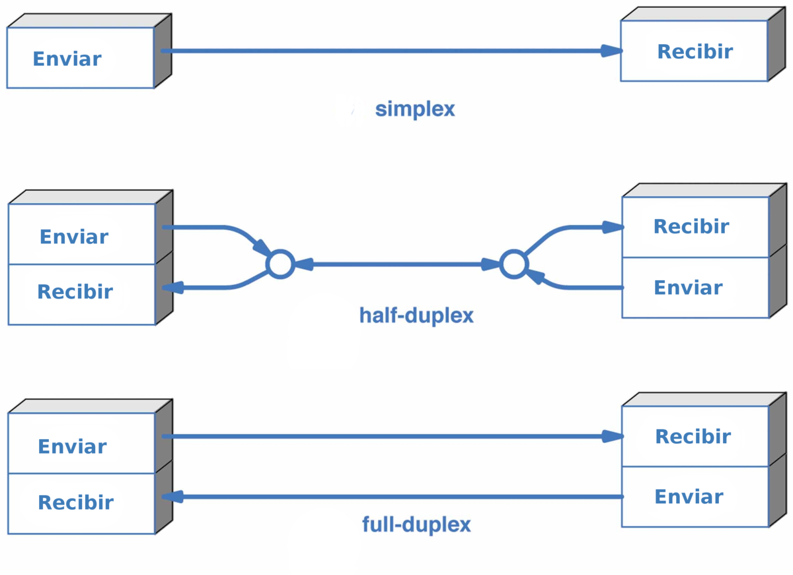
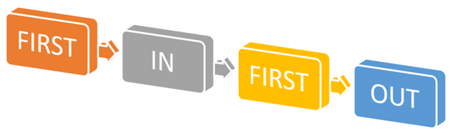
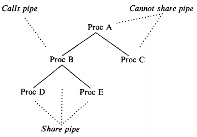

<!-- $theme: gaia -->
<!-- $size: 16:9 -->


# Clase 4

---

<!-- page_number: true -->

### En una clase anterior

#### Uso de archivos:

* Comunicación entre procesos no relacionados
	* Comunicación entre **varios** procesos
* Comunicación entre procesos vivos
* Capacidad de comunicar varios datos
- No son ni proveen un mecanismo de sincronización

---
<!-- *page_number: false -->

# Clase 4
## Pipes & Fifos

---

### Pipes & Fifos

Mecanismo de comunicación **unidireccional** entre procesos <br>(_half-duplex_)


<center> 



</center>


---

### Pipes & Fifos

Se comportan como colas: ==F==irst-==I==n / ==F==irst-==O==ut

<center>



</center>

---

### Pipes & Fifos (Pipes)

* También conocidas como: _unnamed pipes_
* Los procesos que comunican deben tener relación entre si, ej:
	* Mismo padre
	* Ser padre e hijo

---
### Pipes & Fifos (Pipes)
<center>



</center>

---

### Pipes & Fifos (Fifos)

* También conocidas como: _named pipes_
* Los procesos que comunican pueden no tener relación alguna entre si
* Reside "físicamente" dentro del filesystem como archivo


---
<!-- *page_number: false -->

## Operaciones

---
### Operaciones

<center>
  
|Operación|Archivos|Pipes|Fifos|
|:--:|:--:|:--:|:--:|
|Crear| `open` | ? | ? |
|Abrir|`open` | ? | ? |
|Operar| `read`/`write` | ? | ? |
|Cerrar|`close` | ? | ? |
|Eliminar| `unlink` | ? | ? |

</center>
  
---
<!-- *page_number: false -->

# Creación 
## _Pipes_

### `pipe`

---
### Creación (Pipes) `pipe`

```C
int pipe ( int pipefd[2] );
```

* `pipefd`: Array de descriptores
	* Posición 0 - file descriptor de lectura
	* Posición 1 - file descriptor de escritura
	
    
:warning: Nota: Al ser un canal half-duplex, el proceso debe cerrar uno de los dos. ==**NO** se puede leer y escribir del mismo pipe==

---
### Creación (Pipes) `pipe`

```c
int pipe ( int pipefd[2] );
```


* Devuelve 0 en caso de éxito. Si falla, devuelve -1, y setea la variable externa `errno`  

```c
int file_descriptors [2];

int result = pipe(file_descriptors);

if (result == -1){
    perror("Error: ");
    exit(-1);
}

close(file_descriptors[1]);
```
---
# Creación 
## _FIFOs_

### `mknod`

---
### Creación (FIFOs) `mknod`

```C
int mknod ( const char* pathname, mode_t mode, dev_t dev );
```

* `pathname`: Nombre del archivo que representa el FIFO
* `mode`: `S_IFIFO` | permisos
* `dev`: Se ignora, poner `0`

Devuelve:
  *	0 en caso de éxito. 
  * -1 en caso de error y setea la variable externa `errno`  

---

# Operar


---

### Operaciones de lectura/escritura


Se puede operar sobre los pipes y fifos como si fueran archivos comunes, usando las funciones `read` y `write` sobre sus file descriptor:

* Lectura

```c
ssize_t read (int fd, void* buf, size_t count);
```
* Escritura 

```c
ssize_t write (int fd, const void* buf, size_t count);
```
---

### Operaciones de lectura/escritura

Para conseguir el file descriptor de un FIFO, se debe abrir con open como si fuera un archivo común

* Lectura
```c
int fd = open(path, O_WRONLY);
```
* Escritura 
```c
int fd = open(path, O_RDONLY);
```

---

### Operaciones de redirección

Existen funciones (de archivos), que permiten redireccionar la entrada y salida estándar un proceso

```C
int dup(int oldfd);`
```

* Crea un file descriptor como copia del `oldfd` utilizando el menor descriptor posible
* Devuelve:
  *	El file descriptor copiado en caso de éxito 
  * -1 en caso de error y setea la variable externa `errno`  


---
### Operaciones de redirección

```C
int dup2(int oldfd, int newfd);`
```

* Copia el file descriptor `oldfd` en el descriptor `newfd`, cerrando primero `newfd` si es necesario
* Devuelve:
  *	El file descriptor copiado en caso de éxito 
  * -1 en caso de error y setea la variable externa `errno`  

---

### Operaciones de redirección

 Reasignación de la entrada estándar

```C
int file_descriptors [2];

int result = pipe(file_descriptors);
close(file_descriptors[1]);

dup2(file_descriptors[0],0);

// Leo un dato desde el pipe
char buffer[BUFFSIZE];
std::cin.get ( buffer , BUFFSIZE );
```
---

### Operaciones de redirección

Reasignación de la salida estándar

```C
int file_descriptors [2];

int result = pipe(file_descriptors);
close(file_descriptors[0]);

dup2(file_descriptors[1],1);

// Escribo un dato en el pipe
std::cout << "Hello pipe" << std::endl;
```

---

# Destrucción

---

### Destrucción

```c
int close(int fd);
```

* Para eliminar un pipe, el proceso debe cerrar el file descriptor que dejó abierto
* Para eliminar un FIFO, el proceso debe cerrar el file descriptor que obtuvo con `open`

==En el caso de los FIFOs, debe eliminarse también el archivo==

```c
int unlink (const char* pathname);
```

* El archivo ya no se puede acceder por su nombre

---

# Recap

---

### Operaciones

<center>
  
|Operación|Archivos|Pipes|FIFOs|
|:--:|:--:|:--:|:--:|
|Crear| `open` | `pipe` | `mknod` |
|Abrir|`open` | `pipe` | `open` |
|Operar| `read`/`write` | `read`/`write` | `read`/`write` |
|Cerrar|`close` | `close` |`close` |
|Eliminar| `unlink` | - | `unlink` |

</center>
  
---

# Sincronización 
# y
# Comportamiento Bloqueante

---

### Sincronización 

* Por default, los pipes y FIFOs tienen un comportamiento bloqueante
	* Sirve como mecanismo de sincronización entre procesos
* Se puede utilizar en forma _no bloqueante_, pero ==**se desaconseja fuertemente su uso**==
	* Pipes:
	```c
    fcntl ( pipe_fd, F_SETFL, O_NONBLOCK );
    ```
    * Fifos:
    	* Utilizar `O_NONBLOCK` en `open`
  
---

# Bloqueante 
# vs
# No Bloqueante

---
<center>
<table>

<tr><th rowspan="2">Operación<th rowspan="2">Estado del pipe/FIFO<th colspan="2">Retorno
<tr><th>Bloqueante<th>No Bloqueante
<tr><th rowspan="2">Abrir para lectura<td>Abierto para escritura<td>OK<td>OK
<tr><td>No abierto para escritura<td>Se bloquea hasta que el FIFO sea abierto para escritura<td>OK
<tr><th rowspan="2">Abrir para escritura<td>Abierto para lectura<td>OK<td>OK
<tr><td>No abierto para lectura<td>Se bloquea hasta que el FIFO sea abierto para lectura<td>OK

</table>
</center>

---

<center>
<table>

<tr><th rowspan="2">Operación<th rowspan="2">Estado del pipe/FIFO<th colspan="2">Retorno
<tr><th>Bloqueante<th>No Bloqueante
<tr><th rowspan="2">Leer de un pipe/FIFO vacío<td>Abierto para escritura<td>Se bloquea hasta que haya datos o sea cerrado para escritura<td>Error EAGAIN
<tr><td>No abierto para escritura<td>0 (EOF)<td>OK

</table>
</center>

---

<center>
<table>

<tr><th rowspan="2">Operación<th rowspan="2">Estado del pipe/FIFO<th colspan="2">Retorno
<tr><th>Bloqueante<th>No Bloqueante
<tr><th rowspan="2">Escribir en un pipe/FIFO<td>Abierto para lectura<td><small>Si bytes <= PIPE_BUF es atomica <br> si  bytes > lugar_libre &rarr; se bloquea </small><td><small>Si bytes <= PIPE_BUF es atomica <br> si  bytes > lugar_libre &rarr; error EAGAIN<small>
<tr><td>No abierto para lectura<td>SIGPIPE (signal)<td>SIGPIPE (signal)

</table>
</center>

---
# Bibliografía

* :book: _The Design of the Unix Operating System_
	* :pen:  Maurice Bach
* :book: _Unix Network Programming, Interprocess Communications_
	* :pen: W. Richard Stevens  
* :computer: Manuales del sistema operativo 


